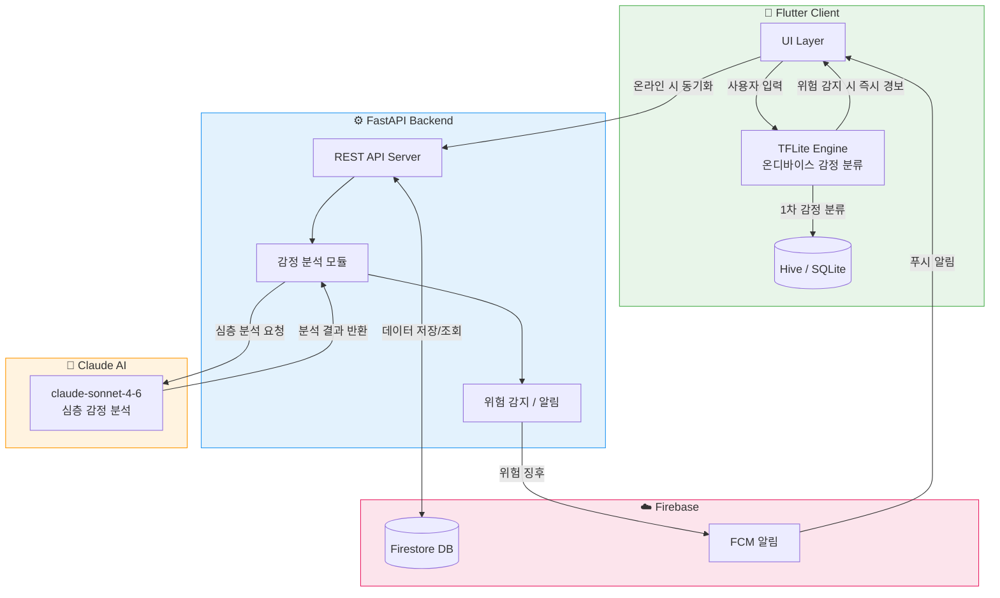

<div align="center">

# 🌿 Mori
### *"일상을 함께하는 AI 친구"*

> 겉으로는 AI 일상 비서, 속으로는 당신의 마음을 지키는 감정 케어 시스템

<br/>

[](https://flutter.dev)
[](https://python.org)
[](https://fastapi.tiangolo.com)
[](https://anthropic.com)
[](https://tensorflow.org/lite)
[](https://firebase.google.com)
[](https://sqlite.org)

</div>

---

## 📌 프로젝트 소개

**Mori**는 겉으로는 일상 비서처럼 보이지만, 속으로는 감정 상태를 지속적으로 분석하고 정신 건강 위험 신호를 조기에 감지하는 **AI 감정 케어 앱**입니다.

| 겉으로 보이는 것 | 속에서 일어나는 것 |
|:---:|:---:|
| 💬 AI 일상 대화 | 감정 분석 및 기록 |
| ✅ 오늘 할일 관리 | 무기력 / 번아웃 패턴 감지 |
| 📔 일기 작성 | 감정 흐름 추적 |
| 📊 감정 리포트 | 위험 징후 감지 + 알림 |

---

## 🏗️ 시스템 아키텍처



---

## 🤖 하이브리드 AI 전략

| 항목 | 🔵 TensorFlow Lite | 🟠 Claude API (claude-sonnet-4-6) |
|:---:|:---:|:---:|
| **처리 위치** | 기기 내부 (온디바이스) | 클라우드 서버 |
| **동작 조건** | 오프라인 포함 항상 동작 | 온라인 시에만 동작 |
| **분석 속도** | ⚡ 매우 빠름 (< 50ms) | 🔄 1~3초 |
| **분석 깊이** | 1차 감정 분류 | 심층 맥락 이해 및 위험 평가 |
| **역할** | 즉각 위험 경보 | 정밀 분석 + 상담 안내 |

---

## 🛠️ 기술 스택

| 분류 | 기술 |
|:---:|:---:|
| **Frontend** | Flutter (Dart) |
| **온디바이스 AI** | TensorFlow Lite `tflite_flutter ^0.10.1` |
| **클라우드 AI** | Claude API `claude-sonnet-4-6` |
| **Backend** | Python, FastAPI |
| **로컬 DB** | SQLite, Hive `^2.2.3` |
| **클라우드 DB** | Firebase Firestore |
| **시각화** | fl_chart `^0.69.0` |

---

## 📁 프로젝트 구조

```
mori/
├── lib/
│   ├── main.dart
│   ├── screens/
│   ├── services/
│   ├── models/
│   ├── utils/
│   └── widgets/
├── assets/
│   └── models/
│       └── emotion_model.tflite
└── pubspec.yaml
```

---

## 🆘 위기상담 안내

> ⚠️ **위험 징후 감지 시 앱이 자동으로 아래 정보를 안내합니다.**

| 상담 서비스 | 번호 | 운영 시간 |
|:---:|:---:|:---:|
| 🧠 정신건강 위기상담 | **1577-0199** | 24시간 |
| 💙 자살예방 상담전화 | **1393** | 24시간 |
| 👦 청소년 상담전화 | **1388** | 24시간 |

---

<div align="center">

*당신의 일상 속에서, 조용히 당신 곁에 있겠습니다.*

[](https://github.com/Userlsj-project/mori.git)

</div>
