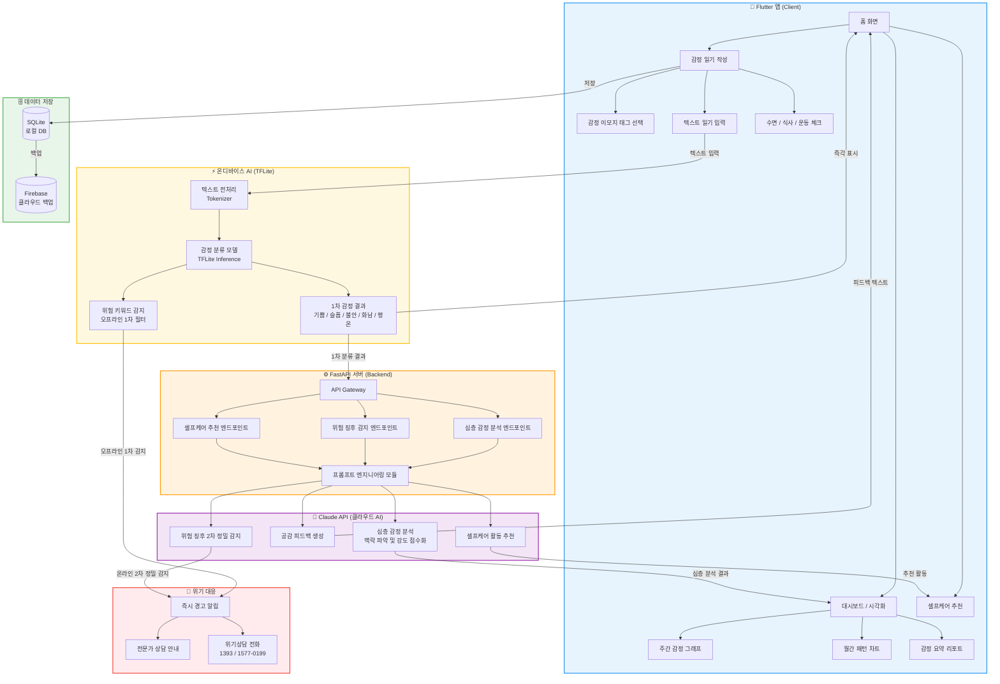

# 🧠 MindLog — AI 정신건강 자가진단 & 감정 일기 앱

<p align="center">
  
  
  
  
  
  
</p>

---

## 📌 프로젝트 개요

**MindLog**는 AI 기반 감정 분석 기술을 활용하여 사용자의 정신건강을 스스로 관리할 수 있도록 돕는 모바일 앱입니다.

매일 감정 일기를 작성하면 **온디바이스 TFLite 모델**이 즉각적으로 1차 감정을 분류하고, **Claude AI**가 심층 분석과 맞춤형 공감 피드백을 제공합니다. 인터넷 연결 없이도 기본 감정 분석이 가능하며, 부정적 감정이 지속될 경우 위험 징후를 조기 감지하여 전문가 상담을 안내합니다.

---

## 🎯 개발 배경 및 목적

- 일상에서 감정 변화를 스스로 인식하기 어려운 문제
- 정신건강 관리를 위한 접근성 부족
- 네트워크 환경에 관계없이 즉각적인 감정 분석 필요
- 위기 상황에서 신속한 도움 연결 체계 미비

온디바이스 AI(TFLite)와 클라우드 AI(Claude API)를 결합한 **하이브리드 AI 아키텍처**를 통해 빠른 응답속도와 심층 분석을 동시에 제공합니다.

---

## ✨ 주요 기능

| 기능 | 설명 |
|------|------|
| 📝 감정 일기 작성 | 텍스트 일기 + 감정 태그 + 수면/식사/운동 체크 |
| ⚡ 온디바이스 감정 분류 | TFLite 모델로 오프라인 즉각 감정 분류 |
| 🤖 Claude AI 심층 분석 | 감정 강도 점수화, 공감 피드백, 셀프케어 추천 |
| 📊 패턴 시각화 | 주간/월간 감정 변화 그래프 및 요약 리포트 |
| 🚨 위험 징후 감지 | 오프라인 1차 + Claude AI 2차 정밀 감지 및 위기 알림 |

---

## 🛠️ 기술 스택

| 분류 | 기술 | 용도 |
|------|------|------|
| **Frontend** | Flutter (Dart) | 크로스플랫폼 모바일 앱 |
| **온디바이스 AI** | TensorFlow Lite | 오프라인 1차 감정 분류 |
| **클라우드 AI** | Claude API (claude-sonnet-4-6) | 심층 감정 분석 및 피드백 |
| **Backend** | Python, FastAPI | REST API 서버 |
| **DB** | SQLite + Firebase | 로컬 저장 + 클라우드 백업 |

---

## 🗂️ 시스템 구조도



---

## 🤖 하이브리드 AI 아키텍처

| 구분 | TFLite (온디바이스) | Claude API (클라우드) |
|------|-------------------|-------------------|
| 동작 환경 | 오프라인 가능 | 인터넷 필요 |
| 응답 속도 | 매우 빠름 (ms 단위) | 초 단위 |
| 분석 깊이 | 1차 감정 분류 | 심층 맥락 분석 |
| 역할 | 즉각 반응 + 오프라인 지원 | 정밀 분석 + 피드백 생성 |

---

## 📁 프로젝트 구조

```
MindLog/
├── app/                              # Flutter 앱
│   ├── lib/
│   │   ├── screens/                  # 화면 (홈, 일기 작성, 대시보드)
│   │   ├── services/
│   │   │   ├── tflite_service.dart   # TFLite 추론 서비스
│   │   │   ├── api_service.dart      # FastAPI 통신
│   │   │   └── db_service.dart       # SQLite DB 서비스
│   │   └── widgets/                  # 재사용 UI 컴포넌트
│   ├── assets/
│   │   └── models/
│   │       └── emotion_model.tflite  # 온디바이스 감정 분류 모델
│   └── pubspec.yaml
│
├── server/                           # FastAPI 백엔드
│   ├── main.py
│   ├── routers/
│   ├── services/
│   └── requirements.txt
│
├── model/                            # TFLite 모델 학습
│   ├── train.py
│   └── convert_tflite.py
│
└── README.md
```

---

## 🚀 실행 방법

### 백엔드 서버

```bash
cd server
pip install -r requirements.txt
uvicorn main:app --reload
```

### Flutter 앱

```bash
cd app
flutter pub get
flutter run
```

### 환경 변수 설정

```
# server/.env
ANTHROPIC_API_KEY=your_api_key_here
FIREBASE_PROJECT_ID=your_project_id
```

---

## 📞 위기상담 안내

본 앱은 전문적인 의료 서비스를 대체하지 않습니다.

- **정신건강 위기상담** : 1577-0199 (24시간)
- **자살예방 상담전화** : 1393 (24시간)
- **청소년 상담전화** : 1388

---

## 📄 License

MIT License
